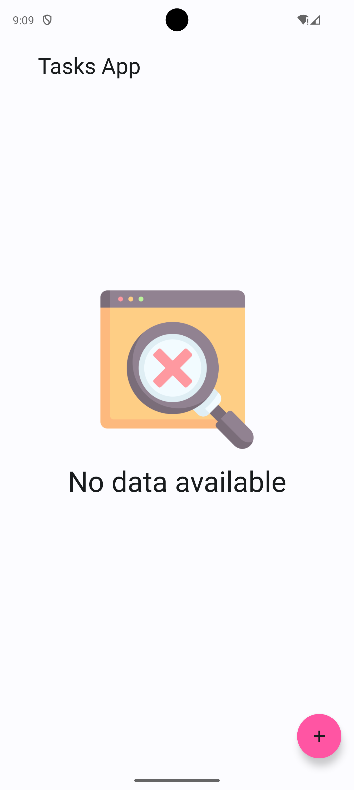
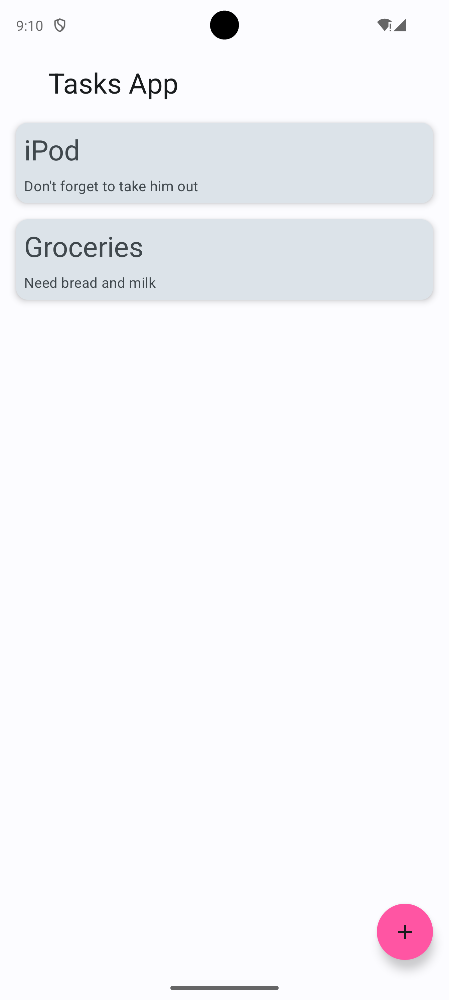

# Toyota App

## Project Description
The Toyota App is a task management application built using Kotlin and Jetpack Compose. It leverages modern Android development practices and libraries to provide a robust and scalable solution for managing tasks.

## Libraries Used
- **Jetpack Compose**: Android’s modern toolkit for building native UI.
- **Hilt**: Dependency injection library for Android.
- **Room**: Persistence library providing an abstraction layer over SQLite.
- **Retrofit**: Type-safe HTTP client for Android and Java.
- **OkHttp**: HTTP & HTTP/2 client for Android and Java applications.
- **Material3**: Material Design components for Jetpack Compose.
- **Coil**: Image loading library for Android backed by Kotlin Coroutines.
- **Kotlin Coroutines**: Library for asynchronous programming.

## Screenshots
<table>
    <tr>
        <td></td>
        <td></td>
    </tr>
</table>

## Architecture
The project follows the **MVVM (Model-View-ViewModel)** architecture pattern:
- **Model**: Represents the data layer, including the Room database and Retrofit network calls.
- **View**: Composable functions that define the UI.
- **ViewModel**: Manages the UI-related data and handles the business logic.

### Directory Structure
- `app/src/main/java/com/test/challenge/toyotaapp/`
  - `app`: Application class for initializing Hilt.
  - `data`: Contains the data layer including database entities, DAOs, and repository implementations.
  - `di`: Dependency injection modules.
  - `ui`: Contains the UI layer including Composables and ViewModels.
  - `constants`: Contains global constants used throughout the app.

## Getting Started
### Prerequisites
- Android Studio
- Kotlin 1.9.0
- Android SDK 34

### Installation
1. Clone the repository:
   ```sh
   git clone https://github.com/your-repo/toyota-app.git